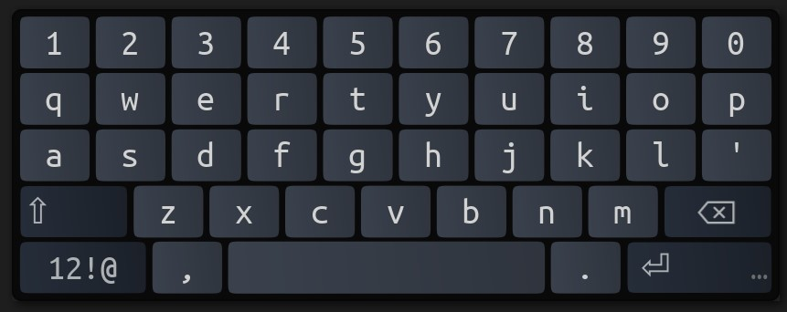
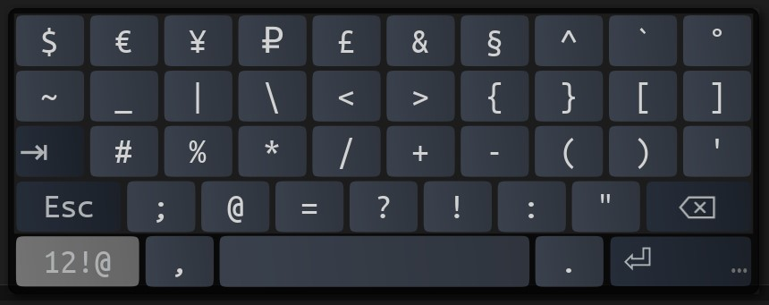

# OnboardLayout-PhonePlus
A custom Onboard layout that modifies the minimalist "Phone" layout to include number row on first layer. All special chars on 1 alt layer instead of 3. Emojis have been removed and Esc has been added.

This layout is ideal for ~10" touchscreens, but works well at just about every size.

## Installation
- Open Onboard Preferences and go to "Layout." 
- Click "Open Layouts Folder" and insert the layout files from this project there.
- Close and reopen Onboard Preferences and the new PhonePlus layout should be there.

## Images
First Layer

Symbol Layer

## License
Licensed under [GPLv3](https://www.gnu.org/licenses/gpl-3.0.en.html).